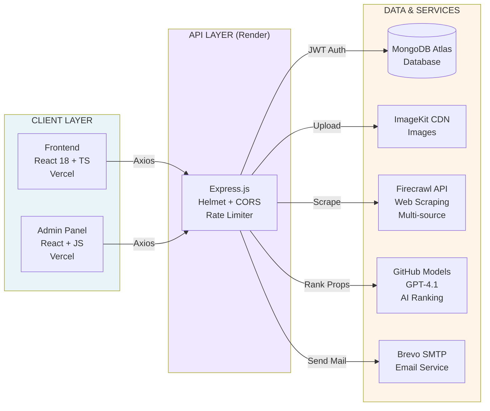
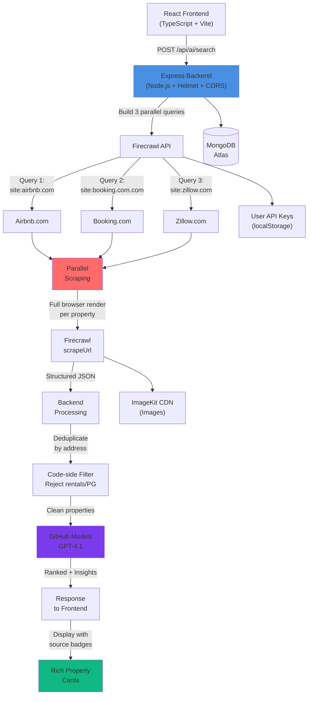

# Blockchain_Based-Real_Estate-DEX-Marketplace
Blockchain based Real estate Marketplace. using AI and NFT features. House and property Sale Purchase, rental, property listings website.  Blockchain, Node.js React/Next.js stack 


## Project Structure

```text
Real-Estate-Website/
├── frontend/          → User-facing website (React + TypeScript + Vite)
├── admin/             → Admin dashboard (React + Vite)
├── backend/           → REST API server (Node.js + Express)
├── Image/             → README screenshots
└── .github/           → Issue templates, PR template, CODEOWNERS
```

**Frontend src/**

```text
├── components/
│   ├── ai-hub/            → AI Property Hub (search form, results, trends)
│   ├── common/            → Navbar, Footer, SEO, PageTransition
│   ├── home/              → Homepage sections
│   ├── properties/        → Filter sidebar, property cards
│   ├── property-details/  → Gallery, amenities, booking form
│   ├── about/             → About page sections
│   └── contact/           → Contact page sections
├── contexts/              → AuthContext (JWT state management)
├── hooks/                 → useSEO
├── pages/                 → All pages (lazy loaded via React.lazy)
└── services/              → api.ts (Axios client + API key injection)
```

**Backend**

```text
├── config/         → MongoDB, ImageKit, Nodemailer config
├── controller/     → Route handlers (property, appointment, AI search)
├── middleware/      → JWT auth, Multer uploads, stats tracking, request transform
├── models/         → Mongoose schemas (Property, User, Appointment, Stats)
├── routes/         → Express route definitions
├── services/
│   ├── firecrawlService.js  → Smart scraping (30+ cities, URL construction, retry logic)
│   └── aiService.js         → GPT-4.1 property analysis + location trends
├── utils/          → AI response validation & safe parsing
└── server.js       → Entry point (Helmet, CORS, rate limiting)
```

**Admin src/**

```text
├── components/     → Login, Navbar, ProtectedRoute
├── config/         → Property types, amenities constants
├── contexts/       → AuthContext (admin JWT state)
└── pages/          → Dashboard, Add, List, Update, Appointments
```

## Technology Stack

<div align="center">

### Frontend
[](https://react.dev)
[](https://www.typescriptlang.org)
[](https://vitejs.dev)
[](https://tailwindcss.com)
[](https://www.framer.com/motion)
[](https://reactrouter.com)

### Backend
[](https://nodejs.org)
[](https://expressjs.com)
[](https://www.mongodb.com)
[](https://jwt.io)
[](https://nodemailer.com)

### AI & Infrastructure
[](https://github.com/marketplace/models)
[](https://firecrawl.dev)
[](https://imagekit.io)
[](https://render.com)

</div>

<br/>

## Architecture

**Complete System Architecture:**



<br/>

**Multi-source AI Property Search Pipeline:**


